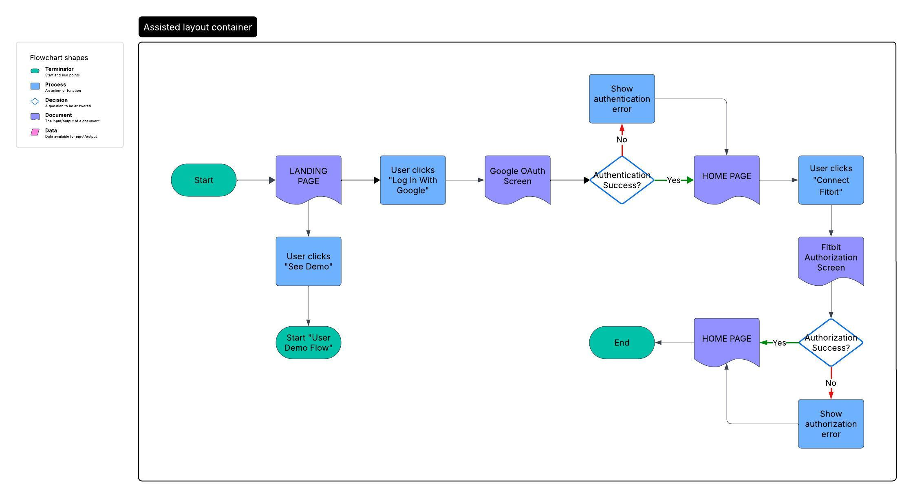

## **1.0 Vision & Strategy**

- **1.1 Vision Statement:** To create a personal health dashboard that actively coaches users to improve their sleep habits through a guided, data-driven Sleep Journey.
- **1.2 Target Persona:** Health-Conscious Harper: A user who isn't interested in deep data analysis but wants clear, actionable advice to improve her well-being. She is the primary target for the "Sleep Journey" feature.
- **1.3 Success Metrics:**
  - _This section needs specific, quantifiable business and user goals. This helps define what a "successful" outcome for the project looks like._
  - **_Example Business Metric:_** _Achieve 1,000 monthly active users within 6 months of launch._
  - **_Example User Metric:_** \_50% of users who complete a 4-week "Improve Sleep Consistency" journey see a measurable reduction (e.g., 15% or more) in their bedtime standard deviation.

## **2.0 Functional & User Experience (UX) Specifications**

- **2.1 User Stories:**
  - **Health-Conscious Harper:**
    - As Health-Conscious Harper, I want to begin the "Improve Sleep Consistency" journey that gives me daily, tailored advice to help me achieve my goal.
    - As Health-Conscious Harper, I want to see a simple, visual summary of my last night's sleep on the homepage so that I can quickly understand my progress within my journey at a glance.
    - As Health-Conscious Harper, I want to see actional advice on the homepage so that I can progress within my sleep journey.
    - As Health-Conscious Harper, I want to see an overview of my current sleep journey on the Sleep Journey page.
  - **General:**
    - As a new user, I want to sign up or log in quickly using my Google account to minimize setup friction.
    - As a new user, I want a simple, one-time process to securely connect my Fitbit account so the app can access my sleep data.
    - As a user, I want a settings page to manage my connected accounts and preferences.
    - As a user, I want my sleep data to be stored securely to track my journey's progress over time.
    - As a user, I want the dashboard to load quickly so I can have a smooth user experience.
- **2.2 User Flows:**

  - **2.21 Onboarding Flow**

    - This flow ensures all users get to the home page regardless of authentication of authorization state.
    - There are different home page states depending on a combination of authentication and authorization.
    - The user will have the option to authenticate and/or authorize from the home page.

    

  - **_Needed Flows:_** _Daily Check-in (Open App -> View Summary & Advice), Managing Settings._

- **2.3 UI Sketches:**
  - _This section needs visual representations for each of the app's screens. These can be low-fidelity rough sketches._
  - **_Needed Sketches:_** _Homepage, Onboarding Screens, Settings Page, Sleep Journey page._

## **3.0 System Architecture & Technology Stack**

- **3.1 High-Level Architecture:**
  - **Frontend:** A Next.js single-page application (SPA) that serves the browser client. It will also act as a reverse proxy, handling incoming HTTP requests from the browser and forwarding them to the appropriate backend services. This layer is responsible for receiving data from the backend and shaping it into the necessary format for the UI components.
  - **Backend:** A headless, frontend-agnostic API service. Its sole responsibility is to expose data and execute business logic without any knowledge of the client consuming it. This includes interacting with external services like the Fitbit API, managing all database operations, and providing the data required for the Sleep Journey feature.
- **3.2 Technology Stack:**
  - Frontend: Next.js, TypeScript, MUI, Vercel, Tanstack Query
  - Backend: Express.js, Prisma, Zod, Render
  - Database: Postgresql
  - Authentication: Google OAuth2.0
- **3.3 Data Models & Database Schema:**
  - See Prisma schema in backend directory.

## **4.0 Detailed Technical Specifications**

- **4.1 API Specification (Endpoints):**
  - See Swagger documentation in backend directory.
- **4.2 Core Business Logic (Sleep Journey):**
  - The Sleep Journey feature is the core engine for user coaching. Its logic resides entirely within the backend service.
  - **Journey Initiation & Baseline:** To begin, the backend fetches the user's historical sleep data from Fitbit for the last 14-30 days. It analyzes this data to establish a baseline for the "Improve Sleep Consistency" journey. This involves calculating the average bedtime, wake-up time, and standard deviation (bedtime variance). A coefficient of variation is then calculated from the standard deviation to assign a grade for the user's sleep schedule consistency.
  - **Daily Cycle: Analysis & Advice:** Each day, the backend automatically syncs the user's most recent sleep data from their connected FitBit account. The system compares this new data against the journey's goal and the user's established baseline. Based on this analysis, simple and actionable "Daily Advice" is generated. For example: "Last night you went to bed a bit later than usual. Let's aim for a time closer to your average. Try to be in bed by 11:40 PM tonight".
  - **Weekly Review & Recalibration:** At the end of each week, the backend aggregates the week's sleep data to generate more advanced summaries, such as a chart showing bedtime variance. The system assesses the user's weekly progress and recalibrates the advice. If the user is meeting targets, the advice may become more challenging; if they are struggling, it may become more achievable to ensure the coaching remains personalized and effective.
  - **Journey Completion:** A journey is considered complete when the user consistently meets predefined success metrics for a set period, like maintaining low bedtime variance for two consecutive weeks. Upon completion, the user is congratulated on their achievement.
- **4.3 Error Handling:**
  - _This section needs to define how the system will respond to specific, predictable failures._
  - **_Example Scenario:_** _Fitbit API token expires._
  - **_System Response:_** _Backend attempts to use the refresh token to get a new access token. If successful, retry the original API call. If it fails, mark the user's Fitbit connection as invalid and queue a notification for the frontend to display a "Please reconnect your Fitbit account" message to the user._

## **5.0 Non-Functional Requirements (NFRs)**

- _This section needs to define the system's quality attributes with specific, measurable targets._
- **5.1 Security:** All user PII and health data must be encrypted at rest (e.g., AES-256). All API traffic must use HTTPS.
- **5.2 Performance:** The dashboard must load quickly.
  - **_Specific Target:_** _API p95 latency must be < 300ms. Frontend Largest Contentful Paint (LCP) must be < 2.5 seconds._
- **5.3 Data Integrity:** User sleep data must be stored securely to track progress over time.
  - **_Specific Target:_** _Implement daily backups of the production database with a 30-day retention policy._

## 6.0 MVP Checkpoints

### MVP 1: The Read-Only Wellness Dashboard

Goal: To deliver a functional, end-to-end, read-only dashboard that visualizes a demo user's sleep and wellness data. This MVP focuses on establishing a solid foundation for the data flow from the database to the UI, without the complexities of user authentication or advanced coaching features.

#### Home Dashboard

- Display of core sleep metrics (Bedtime, Wake-Up, Total Sleep, Efficiency).
- Display of daily wellness indicators (Skin Temp, Breathing Rate, HRV, SpO2).
- Visualization of sleep stages (Awake, REM, Light, Deep) in a chart.
- A date selector to navigate through the demo user's historical data, which updates all modules on the page.

#### Sleep History Page

- A tabular data grid displaying a comprehensive list of all sleep logs from the demo user.
- The table will include columns for key metrics like bedtime, wake-up time, total sleep, and sleep stages.

#### API Endpoints

- GET /users/demo: Endpoint to retrieve the hardcoded demo user.
- GET /users/:userId/sleep: Endpoint to fetch all sleep logs for the user.
- GET /users/:userId/sleep/recent: Endpoint for the most recent sleep log.
- GET /users/:userId/sleep/:date: Endpoint to get a specific sleep log by date.
- GET /users/:userId/core-metrics/:date: Endpoint for the core metrics card.
- GET /users/:userId/sleep-stages/:date: Endpoint for the sleep stages chart.
- GET /users/:userId/wellness-summary/:date: Endpoint for the wellness indicators.

#### Data Layer

- A PostgreSQL database seeded with a comprehensive set of sample data for a single demo user.

#### Features (Out of Scope for MVP 1)

- User Authentication: No Google OAuth or any other real user login system. The entire experience will be based on the demo user.
- Sleep Journey Feature: The entire guided coaching experience, including onboarding, advice generation, and progress tracking, will be deferred to MVP 2.
- Data Modification: All API endpoints will be read-only (GET). There will be no functionality to add, edit, or delete data (e.g., the "Daily Check-In" feature).
- Fitbit Integration: No live connection or data sync with the Fitbit API. All data will come from the pre-populated database.

#### Definition of Done

- A user can launch the application and land on the splash page.
- Clicking the "See a Demo" button successfully navigates the user to the home page, loading the demo user's data.
- The Home page correctly displays all core metrics, wellness indicators, and sleep stages for the most recent sleep log.
- The user can use the date selector to view data from previous days, and all components on the Home page update accordingly.
- The user can navigate to the History page and view a complete, scrollable table of the demo user's sleep data.
- The backend API is fully functional for all specified GET endpoints and returns data in the documented DTO format.
- The application is styled and responsive for a good user experience on both desktop and mobile devices.

#### Scheduled Completion Date

- September 30, 2025
